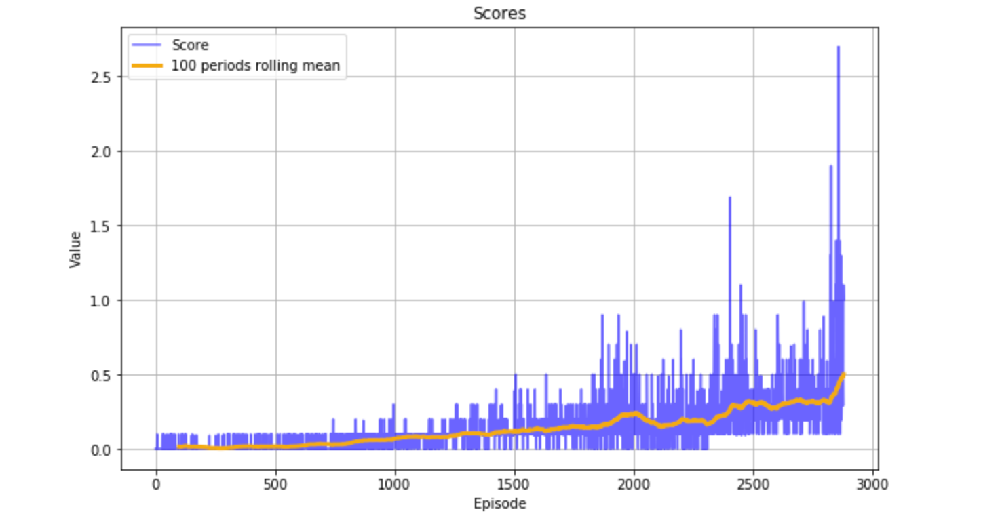

# Udacity Deep Reinforcement Learning - Collaboration and Competition Project.

## Learning Algorithm

## Model Architecture

## Results

The agent slowly improves until episode 2000 then experiences a slight dip in preformace only to recover around episode 2800 and solving the task by the episode 2881

## Ideas for Future Work

To improve the performance we could try several things:

 - Prioritized experience replay: giving higher sample weights to the experiences that had higher error rates.
 - Try using different architectures for our Actor/Critic models
 - We can switch to a different algorithm like AlfaZero.
 